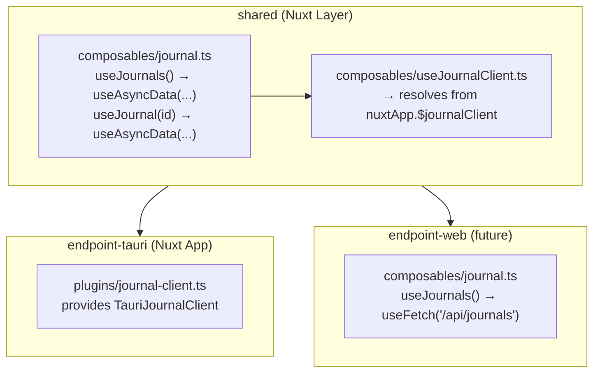

# Migrate Packages to Nuxt 4

## Current State

- `**@white-rabbit/shared**`: Plain Vue 3 library with components, page component, models, and a `JournalClient` interface. Uses `provide/inject` for DI.
- `**@white-rabbit/endpoint-tauri**`: Vite + Vue 3 + Tauri 2 app. Implements `TauriJournalClient` via Tauri `invoke()`. Wires everything with `app.provide()` in `main.ts`.
- Monorepo: Yarn 4.12.0 workspaces, `nodeLinker: node-modules`.

## Composable Abstraction Design

The core problem: shared pages need data fetching that works with both Tauri (`invoke`) and a future web endpoint (`useFetch`). Both `useAsyncData` and `useFetch` return the same `AsyncData<T>` type, so we can unify them.

### DI Pattern: Nuxt Plugin Provide + Composable Injection

We use the documented Nuxt pattern for service injection:

1. **Endpoint plugins provide the client** via `defineNuxtPlugin` + `provide` key ([Nuxt plugins: Providing Helpers](https://nuxt.com/docs/4.x/directory-structure/app/plugins#providing-helpers)).
2. **Shared composables access it** via `useNuxtApp().$journalClient` ([Nuxt composables: Access plugin injections](https://nuxt.com/docs/4.x/directory-structure/app/composables#access-plugin-injections)).

This was chosen over Vue's native `provide/inject` because:

- Nuxt has no `main.ts` — client wiring must happen in a plugin either way.
- `useNuxtApp()` works beyond the component tree (middleware, error handlers), while `inject()` requires a component ancestor.
- Nuxt plugin `provide` gets automatic TypeScript augmentation via `declare module '#app'`.
- `app.config` was ruled out — it is for serializable reactive configuration data, not service instances with methods.




- **Reads**: Shared composables wrap `useAsyncData(() => client.method())`. A future web endpoint can **override** those composables with `useFetch(...)` directly (Nuxt layers: extending app composables take precedence over layer composables).
- **Writes (mutations)**: `useJournalClient()` returns the injected client for imperative calls (`create`, `update`, `delete`). A future web endpoint would provide its own `$fetch`-based client.
- The return types are identical (`AsyncData<T>`), so shared pages/components work with either backend unchanged.

## 1. Convert `@white-rabbit/shared` to a Nuxt 4 Layer

### Directory Restructure

```
packages/shared/
  nuxt.config.ts                          # NEW - declares this as a Nuxt layer
  app/
    components/
      JournalCard.vue                     # from src/components/ (unchanged)
      JournalForm.vue                     # from src/components/ (move JournalFormData to models)
      JournalFilterBar.vue                # RENAMED from JournalFilter.vue (avoid name clash with model type)
    composables/
      useJournalClient.ts                 # NEW - resolves client from nuxtApp.$journalClient
      journal.ts                          # NEW - useJournals(), useJournal(), useJournalMutations()
    pages/
      index.vue                           # REFACTORED from src/pages/JournalListPage.vue
  models/                                 # from src/models/ (outside app/ for package exports)
    journal.ts
    index.ts
  clients/                                # from src/clients/ (outside app/ for package exports)
    journal-client.ts
    index.ts
  index.ts                                # barrel export for types (models + client interface)
  package.json
  tsconfig.json
```

### Key Changes

- `**[packages/shared/package.json](packages/shared/package.json)**`: Add `nuxt` (^4) as devDependency. Set `"main": "./index.ts"` for type exports.
- **New `nuxt.config.ts**`: Minimal layer config.
- **[`app/pages/index.vue`]**: Rewrite `JournalListPage.vue` to use auto-imported composables (`useJournals()`, `useJournalClient()`) instead of `inject`. Leverage `AsyncData` status/error directly.
- `**app/composables/useJournalClient.ts**`: Resolves client from `useNuxtApp().$journalClient`.
- `**app/composables/journal.ts**`: Wraps client reads in `useAsyncData` and exposes mutation helpers that call `refresh()` after writes.
- **Rename `JournalFilter.vue` to `JournalFilterBar.vue**`: The current code already aliases it as `JournalFilterBar` everywhere. This avoids auto-import collision with the `JournalFilter` model type.
- **Move `JournalFormData**` from `JournalForm.vue`'s `<script setup>` to `models/journal.ts` so it is importable without component coupling.
- **Remove `src/` directory, barrel `src/index.ts`, `src/components/index.ts`, `src/pages/index.ts**` after migration.

### Composable Signatures

```typescript
// app/composables/useJournalClient.ts
export function useJournalClient(): JournalClient {
  return useNuxtApp().$journalClient
}

// app/composables/journal.ts
export function useJournals(filter?: MaybeRef<JournalFilter>) {
  const client = useJournalClient()
  return useAsyncData('journals', () => client.list(toValue(filter)), {
    watch: filter ? [isRef(filter) ? filter : undefined].filter(Boolean) : undefined,
  })
}

export function useJournal(id: MaybeRef<string>) {
  const client = useJournalClient()
  return useAsyncData(`journal:${toValue(id)}`, () => client.get(toValue(id)))
}
```

## 2. Convert `@white-rabbit/endpoint-tauri` to a Nuxt 4 App

### Directory Restructure

```
packages/endpoint-tauri/
  nuxt.config.ts                          # NEW - extends shared, ssr: false, devServer port 1420
  app/
    app.vue                               # NEW - minimal root with <NuxtPage />
    plugins/
      journal-client.ts                   # NEW - defineNuxtPlugin providing TauriJournalClient
    assets/
      vue.svg                             # from src/assets/
  clients/
    journal-client.ts                     # from src/clients/ (TauriJournalClient, unchanged)
    index.ts
  public/                                 # unchanged
  src-tauri/                              # unchanged (Rust side stays as-is)
  package.json
  tsconfig.json
```

### Files to Remove

- `vite.config.ts` (Nuxt handles bundling)
- `index.html` (Nuxt generates this)
- `src/main.ts` (replaced by Nuxt app entry + plugin)
- `src/vite-env.d.ts` (Vite-specific)
- `src/App.vue` (replaced by `app/app.vue`)
- `tsconfig.node.json` (Vite-specific)
- `dist/` (Nuxt uses `.output/`)

### Key Changes

- `**[packages/endpoint-tauri/package.json](packages/endpoint-tauri/package.json)**`:
  - Add `nuxt` (^4) as devDependency
  - Remove `vite`, `@vitejs/plugin-vue`, `vue-tsc` devDependencies
  - Update scripts: `"dev": "nuxi dev"`, `"build": "nuxi generate"`, `"preview": "nuxi preview"`
- **New `nuxt.config.ts**`:

```typescript
export default defineNuxtConfig({
  extends: ['@white-rabbit/shared'],
  ssr: false,
  devServer: { port: 1420 },
  devtools: { enabled: false },
})
```

- **New `app/plugins/journal-client.ts**`: Replaces `main.ts` provide:

```typescript
import { TauriJournalClient } from '../../clients'

export default defineNuxtPlugin(() => ({
  provide: { journalClient: new TauriJournalClient() },
}))
```

- **New `app/app.vue**`: Minimal root:

```vue
<template>
  <NuxtPage />
</template>
```

- `**[src-tauri/tauri.conf.json](packages/endpoint-tauri/src-tauri/tauri.conf.json)**`: Update build commands:
  - `beforeDevCommand`: `"yarn workspace @white-rabbit/endpoint-tauri dev"`  (unchanged, script now runs `nuxi dev`)
  - `devUrl`: `"http://localhost:1420"` (unchanged, port kept)
  - `beforeBuildCommand`: `"yarn workspace @white-rabbit/endpoint-tauri build"` (unchanged, script now runs `nuxi generate`)
  - `frontendDist`: `"../.output/public"` (was `"../dist"`)

## 3. TypeScript Plugin Augmentation

To make `useNuxtApp().$journalClient` type-safe, declare the augmentation in shared:

```typescript
// packages/shared/clients/journal-client.ts (append)
declare module '#app' {
  interface NuxtApp {
    $journalClient: JournalClient
  }
}
```

## 4. Root Workspace

No changes needed to root `[package.json](package.json)` or `[.yarnrc.yml](.yarnrc.yml)`. Yarn workspaces and `nodeLinker: node-modules` are compatible with Nuxt 4.

## 5. Documentation Updates

Per `AGENTS.md` rules: new architectural constraints require (1) ADR, (2) architecture doc update, (3) `AGENTS.md` update if enforceable.

### 5.1 New ADR: `docs/adr/0006-nuxt-frontend-client-abstraction.md`

Records the decision to use Nuxt 4 layers with a one-interface / multiple-implementation client abstraction:

- **Status**: Accepted
- **Context**: The project needs a shared frontend (components, pages, composables) that works across Tauri (desktop) and a future web endpoint. Data comes from different sources (Tauri `invoke` vs HTTP API), but pages should be source-agnostic.
- **Decision**:
  1. Use Nuxt 4 layers: `@white-rabbit/shared` is a Nuxt layer providing components, composables, and pages. Endpoint apps extend it.
  2. One client interface (`JournalClient`) with `Promise<T>` returns. Each endpoint provides its implementation via a Nuxt plugin.
  3. Shared composables wrap client calls in `useAsyncData`, returning `AsyncData<T>`. Endpoint apps can override composables entirely (e.g. web uses `useFetch` directly).
  4. Reads go through composables (`useAsyncData`/`useFetch`). Writes use the client imperatively.
  5. Tauri endpoint runs Nuxt with `ssr: false` (SPA mode) for webview compatibility.
- **Consequences**: Shared UI code works across all endpoints without modification. Adding a new endpoint only requires a `nuxt.config.ts` extending the layer and a plugin providing the client. Composable override gives full flexibility for endpoint-specific data fetching.
- **Alternatives Considered**: (a) Vue `provide/inject` — works inside component `setup()` but not in middleware/error handlers; no `main.ts` in Nuxt so a plugin is needed either way, (b) `app.config` / `useAppConfig()` — designed for serializable config data, cannot hold class instances with methods, (c) Nuxt module instead of layer — too heavy for UI sharing, (d) Abstract `useFetch` wrapper hiding source — leaky abstraction across invoke/HTTP.

### 5.2 Update `docs/architecture/README.md`

Add a new section **"14. Frontend Architecture"** covering:

- **Nuxt layer model**: `shared` layer provides components, composables, pages; endpoint apps extend it.
- **Client abstraction**: One `JournalClient` interface, multiple implementations (Tauri `invoke`, HTTP `$fetch`). Client injected via Nuxt plugin, resolved via `useNuxtApp().$journalClient`.
- **Composable pattern**: Shared composables use `useAsyncData(() => client.method())` for reads, returning `AsyncData<T>`. Extending apps can override composables (e.g. replace with `useFetch` for web). Mutations use client directly.
- **Rendering modes**: Tauri uses `ssr: false` (SPA). Web endpoint may use SSR or SSG.
- Reference to ADR-0006.

### 5.3 Update `docs/adr/README.md`

Add `0006-nuxt-frontend-client-abstraction.md` to the index list.

### 5.4 Update `AGENTS.md` (if enforceable constraints)

Add a frontend constraint under **Architecture Constraints**:

- Shared frontend composables must use `useAsyncData` for reads; endpoint-specific data sources must be injected via Nuxt plugin, not hardcoded in shared code.

## Risks / Notes

- **Tauri + Nuxt**: Nuxt with `ssr: false` produces a standard SPA, fully compatible with Tauri's webview. The `nuxi generate` command outputs static files to `.output/public/`.
- **Auto-imports**: Nuxt auto-imports components and composables. Existing explicit imports in Vue files become unnecessary but are not harmful. We will remove them for cleanliness.
- `**JournalFormData` type**: Must move out of `JournalForm.vue`'s `<script setup>` into models, since Nuxt auto-import does not handle types exported from SFCs.
- **Future web endpoint**: Would `extends: ['@white-rabbit/shared']` and either provide its own `JournalClient` plugin or override composables with `useFetch` versions. No changes to shared needed.

